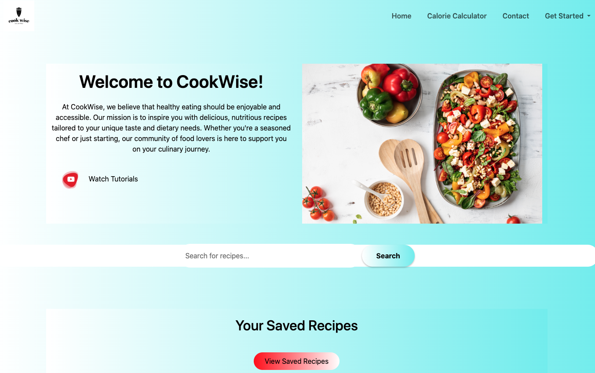
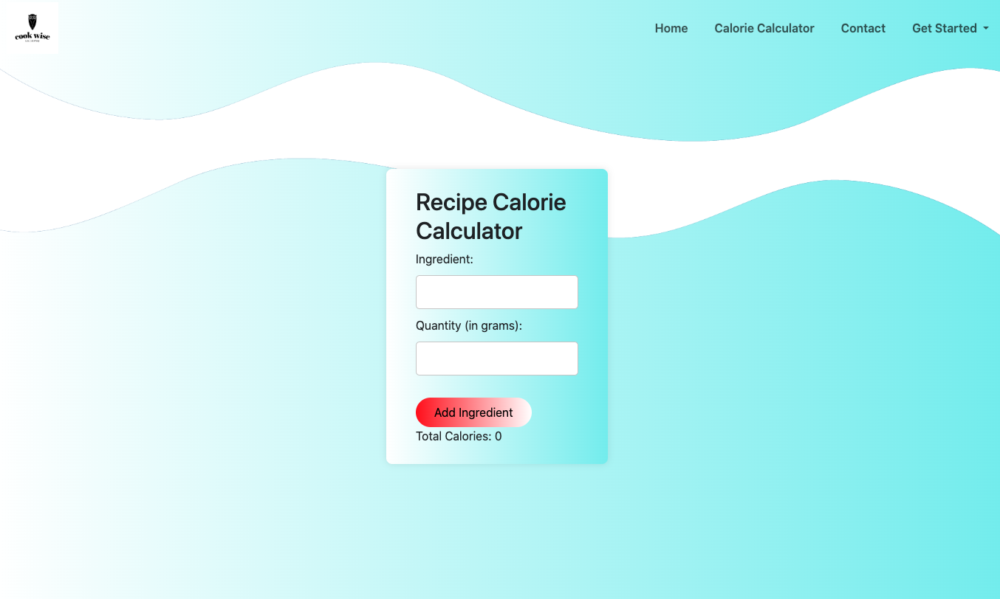

# **CookWise Recipe Website**

**CookWise** is a smart recipe-finding application designed to help users discover the perfect dish based on the ingredients they have at home and their dietary preferences. Whether you're looking to use up ingredients, find recipes that fit your calorie intake, or maintain a healthy diet, CookWise has you covered. By simply entering the ingredients and setting your calorie goals, CookWise provides a variety of recipe options that are quick, easy, and nutritious. The goal of this application is to minimize food waste, help users maintain a healthy diet, and make cooking at home more enjoyable.

This project was developed as part of the USYD Coding Bootcamp Project 1: Interactive Front-End Application.

## **Technologies Used:**

- **Frontend:**
  - HTML5
  - CSS3
  - JavaScript
  - Bootstrap

- **Backend/API:**
  - Recipe Finder API
    
- **Version Control:**
  - Git
    
## **Features:**

- **Ingredient-based Recipe Search:** Enter ingredients to get a list of recipes you can make.
- **Calorie-Conscious Recipes:** Filter recipes based on your calorie intake goals.
- **Healthy Diet Options:** Find recipes that align with your health and dietary preferences.
- **Interactive UI:** User-friendly interface with responsive design.
- **Fun Feature:** "The WiseOwl Guitarist🎸"! To add a bit of entertainment, we've included a charming owl next to the review section. Click on the owl, and watch it play guitar in a delightful GIF! We hope this little feature brings a smile to your day while you share your feedback with us!

 
## **Usage:**

1. Visit the CookWise webpage.
2. Use the search bar to look up recipes based on the ingredients you have.
3. Scroll down to read user reviews of the recipes.
4. Scroll further down in the footer to leave your own review.
5. Click on the "Calorie Calculator" in the navigation bar to access the calorie calculator page.
6. Click on "Get Started" to register or log in to your account.
7. Click on "Contact Me" in the navigation bar to fill out the contact form on another page.

### Live-Demo:

[View a live demo here](https://algomystique.github.io/CookWiseGroupProject_1)
## **License:**
This project is licensed under the MIT License - see the LICENSE file for details.

## Contributing:

Contributions are welcome! If you'd like to contribute, please fork the repository and create a pull request. 
For any suggestions or feedback, feel free to open an issue.
